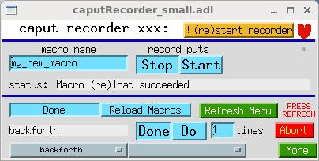
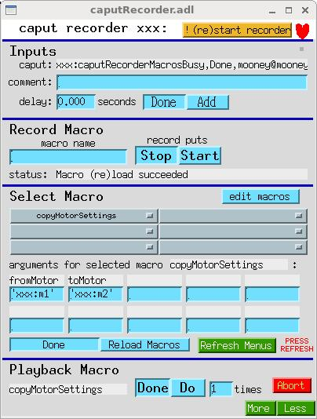
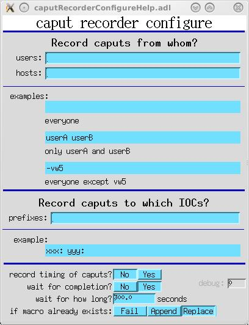
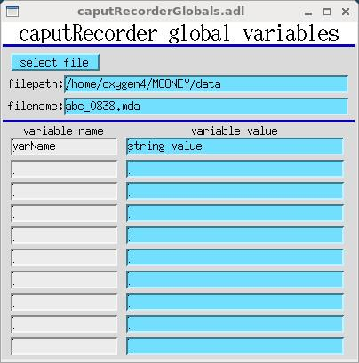

caputRecorder

caputRecorder 1.6

=====================

  
caputRecorder\_small.adl

Table of Contents
-----------------

*   [Overview](#Overview)
*   [How does this work?](#How does this work?)
*   [Requirements, configuration](#Requirements, configuration)
*   [How to use](#How to use)
*   [Selecting what gets recorded](#Selecting what gets recorded)
*   [Record options](#Record options)
*   [Global variables](#Global variables)
*   [Discussion](#Discussion)

Overview
--------

caputRecorder supports the recording and playback of sequences of caputs. It records each caput as a [python](https://www.python.org/) command, and a sequence of caputs as a python function—also called here a **_macro_**. caputRecorder can also serve as a simple user interface for delivering canned python functions to end users. caputRecorder communicates with users via an EPICS database, so it allows any EPICS record or channel-access client to record and run python functions, and to wait for them to complete.

> _caput_ is short for "Channel Access put". When you press a button, or make a menu selection, in an MEDM (or other display manager) display, you are doing a caput. Any program that writes to EPICS PVs does so by doing caputs.

caputRecorder also supports generalizing recorded macros with arguments. (This requires manual editing of python code.) It provides a user interface through which macro arguments are displayed with default values that can be changed via channel access.

This version of caputRecorder is known to work with python 2.7. It probably will not work with python 3.

caputRecorder is intended to meet the following kinds of needs:

*   Automate measurements involving sequences of steps that users know how to do manually, but for which no software has been written. If users can do a measurement step manually while the recorder is on, they will in effect have written software to automate that step, and they can then combine several such steps as needed to perform a particular instance of the measurement type.
    
*   Improve communication between users and the software developers who support them. Rather than describing needed software in general terms, or laboriously listing the required actions in the required order, a user can simply record them, with comments for any actions outside of EPICS, and send the developer the python code.
    
*   Assist in troubleshooting, by recording exact sequences of caputs that do and do not reproduce a problem.
    
*   Automate testing, by recording sequences of caputs that succeed with the current version of some software, and playing them back to verify that they also succeed with the new version.
    
*   Show someone how to operate a complicated device by operating it yourself, while recording, and emailing them the python code.
    
*   Record everything a user does. (But [caPutLog](http://www-csr.bessy.de/control/SoftDist/caPutLog) is a _much_ better tool for this purpose.)
    

How does this work?
-------------------

EPICS access security has the ability to call a user function whenever a caput that meets certain criteria is received by an IOC. The function is called an _access-security trap listener_, and caputRecorder provides one which writes a _caput-notification_ string of the form "pvname,value,user@host" to an EPICS PV whenever an eligible caput is received by the IOC.

caputRecorder provides an EPICS database that contains the EPICS PV mentioned above, and other PVs that function as caputRecorder's user interface. The user-interface PVs are monitored by the python program caputRecorder.py, and direct its operation. When caputRecorder.py is given a macro name and told to record, it begins monitoring the caput-notification PVs of specified IOCs, and writes python commands corresponding to each notification into the python program file macros.py. Here's what a typical command looks like:

> epics.caput("xxx:scan1.P1PV","xxx:m2.VAL", wait=True, timeout=1000000.0)
> 
> This writes the string "xxx:m2.VAL" to "xxx:scan1.P1PV", and waits ~forever for any EPICS processing that might result from the command to complete.

caputRecorder.py also inspects the file macros.py and writes the names of macros in the file to a set of EPICS menus (that is, to the menu-string fields of mbbo records). A user can select a macro name from those menus, and tell caputRecorder to execute that macro.

Thus, each IOC is responsible for telling caputRecorder that it received a caput, and one IOC also hosts the database through which the user tells caPutRecorder what to do.

Requirements, configuration
---------------------------

The caputRecorder database uses record types from the synApps [busy](http://www.aps.anl.gov/bcda/synApps/busy/busy.html) and [calc](http://www.aps.anl.gov/bcda/synApps/calc/calc.html) modules. The workstation on which caputRecorder.py runs must have python with the [PyEpics](https://cars.uchicago.edu/software/python/pyepics3) module installed.

EPICS IOCs that participate in caputRecorder, either by posting the caputs they receive, or by hosting the database that functions as caputRecorder's user interface, must be prepared as follows. (These are excerpts from the synApps xxx module, release R5-8, which is already configured to use caputRecorder.)

1.  Add `CAPUTRECORDER` to the IOC's RELEASE file
    
2.  Include `caputRecorder.dbd` in the IOC's .dbd file.
    
3.  Link the IOC's code against the `caputRecorder` library.
    
4.  Load the database `caputPoster.db`
    
    > dbLoadRecords("$(CAPUTRECORDER)/caputRecorderApp/Db/caputPoster.db","P=xxx:,N=300")
    
    > where `N` is the length of the longest caput-notification string ("pvname,value,user@host") that will be sent to the recorder.
    
5.  If this IOC will host caputRecorder's user interface, load the database `caputRecorder.db`
    
    > dbLoadRecords("$(CAPUTRECORDER)/caputRecorderApp/Db/caputRecorder.db","P=xxx:,N=100")
    
    > where `N` is the length of the comment, users, hosts, and prefixes strings.
    > 
    > If you're using autosave, you'll probably also want to include `caputRecorder_settings.req` in the IOC's `auto_settings.req` file:
    > 
    > file caputRecorder\_settings.req P=xxx:,N=100
    > 
    > If you do this, you must also add the following line to save\_restore.cmd:
    > 
    > set\_requestfile\_path("$(CAPUTRECORDER)", "caputRecorderApp/Db")
    
6.  Register caputRecorder's access-security trap listener. (Note that this command must be executed _after_ iocInit.)
    
    > registerCaputRecorderTrapListener("xxx:caputRecorderCommand")
    
    > where `xxx:caputRecorderCommand` is the name of the PV to which caput-notification strings will be written.
    
7.  Run EPICS access security with an access-security file that specifies `TRAPWRITE` for the desired users and hosts.
    
    > iocsh
    > asSetFilename("$(TOP)/iocBoot/accessSecurity.acf")
    > exit
    
    where the file `accessSecurity.acf` might have the following content:
    
    > HAG(workstation) {mooneylinux.aps.anl.gov}
    > UAG(user) {mooney}
    > ASG(DEFAULT) {
    > 	RULE(1,READ)
    > 	RULE(1,WRITE,TRAPWRITE) {
    > 		HAG(workstation)
    > 		UAG(user)
    > 	}
    > 	RULE(1,WRITE)
    > }
    > 
    > This file grants write permission to anybody on any host, and specifies that TRAPWRITE is in effect only for user _mooney_ on workstation _mooneylinux_. For the purposes of caputRecorder, you probably don't want TRAPWRITE in effect for caputs from an IOC, but do want it for caputs from channel-access clients, such as MEDM, that aren't in an IOC.
    > 
    > Note that the order in which rules occur in the file matters for TRAPWRITE. If `RULE(1,WRITE)` were encountered before `RULE(1,WRITE,TRAPWRITE)`, TRAPWRITE would not be in effect for anybody, because everybody is covered by `RULE(1,WRITE)`.
    > 
    > If you can't or don't want to select users and hosts using access-security rules, you can specify TRAPWRITE for all, and select users and hosts with caputRecorder's user interface. The simplest possible access-security file that will work for caputRecorder is the following:
    > 
    > ASG(DEFAULT) {
    > 	RULE(1,WRITE,TRAPWRITE)
    > }
    
8.  The following environment variables must be set before running MEDM (caQtDM, etc.):
    
    START\_PUTRECORDER
    
    The path to a script that starts caputRecorder.py. This will be used by the "!(re)start recorder" button described below. There is a sample copy of a script that does this for Linux here:
    
    caputRecorder/example\_start\_putrecorder
    
    It is important that only one copy of caputRecorder.py (for a given user-interface database) is running at a time. caputRecorder.py detects the launch of a new copy of itself that uses the same control PVs, and exits.
    
    MACROS\_PY
    
    The path to the macros file, in which caputs will be recorded. There is an example copy of this file here:
    
    caputRecorder/caputRecorderApp/op/python/example\_macros.py
    
    EDITOR
    
    The command that invokes your preferred editor, which will be used for the "edit macros" button described below.
    

How to use
----------

  
caputRecorder.adl

Referring to the caputRecorder.adl display above, from top to bottom:

*   The button labelled "!(re)start recorder" starts or restarts the python program caputRecorder.py.
    
*   The heart symbol to the right of the "!(re)start recorder" button blinks while caputRecorder.py is running and responsive to its control PVs.
    
*   **Inputs**
    
    *   The text-monitor field labelled "caput:" displays the PV name and value most recently written to the IOC. This field is written to by the access-security trap listener, and is updated whether or not a python macro is being recorded.
        
    *   The text-entry field labelled "comment:" allows you to add comments to the macro being recorded. This field is monitored only while a macro is being recorded.
        
    *   The text-entry field labelled "delay" specifies the time delay in seconds of the delay command that will be added to the macro being recorded when you press the "Add" button. The actual python code for this command will be something like `time.sleep(1.200)`. After caputRecorder.py has written the delay command, it will press the "Done" button.
        
*   **Record Macro**
    
    *   The text-entry field labelled "macro name" specifies the name of the macro (python function) you will record.
        
        > By default, you aren't permitted to use a macro name that already exists in macros.py. (See [Record options](#Record options).)
        > 
        > Also note that the macro name must start with a letter, and must consist of letters digits, and underscores. caputRecorder will enforce this by prepending "a" and/or replacing offending characters with underscores. The macro name will be truncated to 25 characters; this limit is set by the length of an mbboRecord's menu-string field.
        
    *   The choice button labelled "record puts" is used to start and stop recording. While recording, you can write to EPICS PVs via any EPICS client, and you can also execute any macro that has already been recorded.
        
    *   If you execute macro **A** while recording macro **B**, and then stop recording while macro **A** is still executing, caputRecorder will make you wait for macro **A** to finish before allowing you to start a new recording of another macro.
        
    *   When you execute macro **A** while recording macro **B**, caputRecorder will suppress recording of the caputs that result from the execution of macro **A**, and will simply record a function call to macro **A**.
        
*   **Select Macro**
    
    *   The button labelled "edit macros" invokes the command named by the environment variable EDITOR on the file macros.py.
        
    *   The gray boxes are menus, which will contain the names of recorded macros, and they are the means by which a macro can be selected manually for playback. Currently caputRecorder supports six menus, each of which can hold 16 macro names.
        
    *   The text-monitor and text entry fields under the "arguments for selected macro" label are the names and default values of the arguments, if any, of the selected macro. As recorded, macros have no arguments, but you can edit the python code to add up to 20 arguments. Only ten arguments are displayed by caputRecorder.adl; caputRecorderExecute.adl (called up from the "Less" menu) displays all 20. If you do add arguments, you must use the "name=value" syntax for defining macro arguments. For example, here is a macro definition with one string argument, and three numeric arguments:
        
        def motorscan(motor="m1", start=0, end=1, npts=11):
        
    *   Normally, you should not have to press the "Reload Macros" button, because caputRecorder reloads automatically after a new macro has been recorded. However, if you edit macros.py manually, you must press "Reload Macros" to tell caputRecorder to reread the file. (If you deleted a function definition from macros.py, reloading isn't sufficient; you must restart caputRecorder, using the "!(re)start recorder" button.)
        
    *   The "Refresh Menus" button must be pressed whenever menus have changed. This happens when macro recording is done, after you press the "!(re)start recorder" button, after you press the "Reload Menus" button, and after the controlling IOC reboots. caputRecorder will tell you when menus need to be refreshed by showing the blinking text "PRESS REFRESH". This blinking text will go away when _any_ instance of caputRecorder.adl, or caputRecorder\_small.adl, is refreshed.
        
*   **Playback Macro**
    
    *   The text-monitor field contains the name of the selected macro. To play it back (to cause python to execute it) press the "Do" button. When the macro has finished, the "Do" button will return to the "Done" state. If you want to execute the macro repeatedly, enter the number of times in the field labelled "times."
        
    *   The "Abort" button is intended to stop an executing macro, and also to do any other abort-related work specified in the function named "\_abort" in macros.py. The supplied _example\_macros.py_ defines an abort function that aborts scans, halts motors, and stop the scaler named "scaler1".
        
    *   Any EPICS client or record can trigger macro execution by writing a macro name to "$(P)caputRecorderMacro", optionally writing to any argument fields, and then writing "Do" (or the number 1) to "$(P)caputRecorderExecuteMacro". The client _must_ wait for completion after both writes, to ensure that arguments have been updated before writing to them or executing the macro, and to wait for macro execution to finish.
        

Selecting what gets recorded
----------------------------

You probably don't want to record all caputs that happen among your IOCs and clients, but only those done by users. One way of filtering was shown above, in "Requirements, configuration". User-specified filtering is easier, and can be done at run time with caputRecorder's user interface.

1.  You can choose which users' caputs will be recorded by specifying usernames to `caputRecorderUsers`. (See "Record caputs from whom?" in the figure below.) To disable recording from a specific user, put a minus sign in front of the username.
    
2.  You can choose which hosts' caputs will be recorded by specifying hostnames to `caputRecorderHosts`. (See "Record caputs from whom?" in the figure below.) Only the first element of a host name need be specified. (For example, "mooneylinux.aps.anl.gov" is used as "mooneylinux".)
    
3.  You can choose which IOCs caputRecorder monitors, by specifying prefixes to `caputRecorderPrefixes`. (See "Record caputs to which IOCs?" in the figure below.) Unlike user and host choices, this choice does not take effect while a macro is being recorded. Also unlike user and host choices, this choice is not about the sender of a caput, but about the recipient.
    
    On startup, caputRecorder monitors the iocs whose prefixes are specified on the command line. If `caputRecorderPrefixes` is not empty, it will override the initial list of iocs.
    
4.  Caputs within an IOC will never be recorded, because they don't go through access security.
    
      
    caputRecorderConfigure.adl
    

Record options
--------------

*   **Timing**
    
    The timing of caputs will, in general, be different on replay than when recorded, but you can tell caputRecorder to try to reproduce the timing. If you select "Yes" for "record timing of caputs?" (see diagram above), caputRecorder will insert delays between caput commands. You can change this setting while recording. Note that if caputRecorder waits for completion, the required delay time could be negative, in which case caputRecorder will insert no delay.
    
*   **Wait for completion**
    
    You can choose whether or not caputRecorder will wait for completion after executing recorded caputs, by setting "wait for completion?" (see diagram above). Note that this affects the python code written while recording, and is not an execute-time choice. You can change this setting while recording.
    
    If you tell caputRecorder to wait for completion, you can tell it for how long to wait, using the text-entry field labelled "wait for how long?". You can change this time while recording.
    
*   **Behavior if macro name already exists**
    
    If you attempt to record a macro whose name is already defined in macros.py, caputRecorder will do one of three things, depending on the setting of the "if macro already exists:" switch:
    
    **Fail**
    
    Refuse to start recording, and set the Stop/Start switch back to Stop.
    
    **Append**
    
    Move the macro to the end of the file, and begin appending commands to it.
    
    **Replace**
    
    Delete the existing macro, and begin a new macro with that name. In this case, caputRecorder will write a backup copy of macros.py, named "macros.py\_yymmdd-HHMMSS", where "yy..." is the current date and time.
    

Global variables
----------------

caputRecorder maintains a small number of EPICS PVs that can be used as global variables in any macro. The EPICS display for these variables is shown below.

  
caputRecorderGlobals.adl

If wxPython is available, the variables 'filepath' and 'filename' are supported by a file requester. If wxPython is not available, the variables can still be used, but values must be entered manually.

The rest of the variables are generic: both a variable name and its string value can be specified. A macro can retrieve global variables by calling the function \_getGlobals(prefix='xxx:') (imported from caputRecorder). \_getGlobals() returns a python dictionary with global variable names and values. For the display above, the following dictionary would be returned:

{'varName': 'string value',
'filename': 'abc\_0838.mda',
'filepath': '/home/oxygen4/MOONEY/data'}

Here is sample code demonstrating the use of global variables in a macro:

def testGlobals():
	g = \_getGlobals("xxx:")
	print "globals=%s" % g

	filename = g\['filename'\]
	print "filename = ", filename

Discussion
----------

*   caputRecorder "reads" the macros.py file by importing it:
    
    import macros.py
    
    After macros.py has been changed, caputRecorder "rereads" it by reloading :
    
    reload(macros)
    
    Reload will overwrite objects in the live macros module with values from macros.py, but it will not delete any objects. If you delete a function definition or a global variable from macros.py, reloading won't remove it from the live copy of the macros module; you have to restart python, which you can do by pressing the "!(re)start recorder" button.
*   caputRecorder records a caput with the following python code:
    
    epics.caput("xxx:scan1.P1PV","xxx:m2.VAL", wait=True, timeout=1000000.0)
    
    This code will request a completion callback from EPICS, and will wait ~forever for the callback to arrive.
    
    Currently, it is not an error for a macro to timeout while waiting for a callback. Python will simply move on to the next command and execute it. Currently, caputRecorder does not take advantage of PyEpics' ability to execute several commands and then wait for all to complete (that is, the "use\_complete" option of the PV class's put() method).
    
*   [caPutLog](http://www-csr.bessy.de/control/SoftDist/caPutLog) can also trap caputs and write them to a PV. A proof-of-principle implementation of caputRecorder used caPutLog 3.4 to do this, but it didn't handle long strings.
    
*   In EPICS 3.14.12.4 and earlier, and in versions of 3.15 earlier than 3.15.2, access security did not provide the data from a caput to the asTrapListener, so caputRecorder used dbGetField() to get the data after it had been written. This was ok for most PVs, but some PVs (for example, the tweak fields of a motor record) have their values changed immediately after being written, and caputRecorder was getting the final value, rather than the value the user actually wrote. Andrew Johnson fixed this by providing data to the asTrapListener, and caputRecorder R1-4 and later will use this capability if it is present.
    
*   caputRecorder R1-4 monitors the connection status of one of its PVs, and exits if that PV remains disconnected for more than 10 seconds.
    
*   The EDM display-file translation failed at the adl file's "shell command", so I just deleted those items from the EDM displays.
    
*   You can run more than one instance of caputRecorder in an IOC (but only one copy per IOC of caputPoster.db is supported). To run two instances of caputRecorder, you must give them different prefixes:
    
    dbLoadRecords("$(CAPUTRECORDER)/caputRecorderApp/Db/caputPoster.db","P=xxx:,N=300")
    dbLoadRecords("$(CAPUTRECORDER)/caputRecorderApp/Db/caputRecorder.db","P=xxx:,N=100")
    dbLoadRecords("$(CAPUTRECORDER)/caputRecorderApp/Db/caputRecorder.db","P=xxxA:,N=100")
    ...
    iocInit
    ...
    registerCaputRecorderTrapListener('xxx:caputRecorderCommand')
    
    start\_putRecorder must specify a different name for macros.py for the two instances. The example\_start\_putRecorder script does this as follows:
    
    MACROS\_PY=${MACROS\_PY\_DIR}/"macros\_"${PREFIX}.py
    # start caputRecorder.py
    $COMMAND ${PREFIX} ${MACROS\_PY}&
    
    Also, you must tell the second copy to look at the one installed copy of caputPoster.db (that is, the xxx:caputRecorderCommand PV) by specifying the prefix in the "prefixes:" string.
